# 👋 Hello, I'm José Roberto

🎓 Software Engineering Student (5th semester)  
💻 Backend-Focused Full Stack Developer  
📍 Goiás, Brazil  

I build scalable applications using **Python, Java and modern Web technologies**.  
Currently focused on **backend architecture, automation and clean system design**.

I value structured code, maintainability and continuous technical evolution.

---

## 🌐 Connect With Me

---

## 🚀 Tech Stack

---

## 🧠 Featured Projects

### 🎭 TeatroABC — Java  
Final semester project built in Java.  
A ticket management system simulating a theater ticket sales platform (without real payment integration), focused on object-oriented programming, system structure and business rule implementation.  
🔗 https://github.com/CharlieChaplim/TeatroABC  

---

### 🤖 Jaguar — RP Discord Bot (Python)  
Roleplay-focused Discord bot featuring climate generation, choice commands, dice systems and interactive mechanics for RPG environments.  
Designed around modular command handling and structured logic.  
🔗 https://github.com/CharlieChaplim/Jaguar  

---

### ⚙ Lass — Character & Powers Database Bot (Python)  
Discord bot designed to manage character sheets and power databases for roleplay servers.  
Focused on structured data storage, command handling and organized information retrieval.  
🔗 https://github.com/CharlieChaplim/Lass  

---

### 🚀 Space Shooter — Java  
Arcade-style space shooter developed in Java, focused on gameplay logic, object interaction and event handling.  
Built to practice game loop structure and real-time mechanics.  
🔗 https://github.com/CharlieChaplim/Space-Shooter  

---

## 📊 GitHub Analytics

  
  

---

## 🟡 Contribution Activity

  

---

## 💬 About Me

- 🧠 Strong logical reasoning  
- 🔥 Passionate about system architecture  
- 🎯 Focused on becoming a high-level backend engineer  
- ⚡ Interested in scalable systems and automation  

---

## 📫 Open to Opportunities

Available for freelance work, collaborations and backend-focused roles.

Let’s build something meaningful.